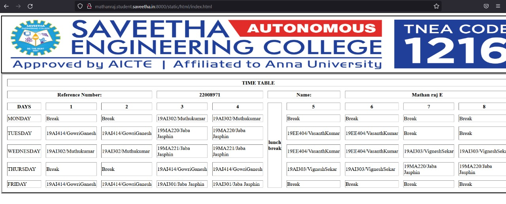

# Experiment_Time_Table

## AIM
To Write a html webpage page to display your timetable.

# ALGORITHM
### STEP 1
create a simple table using table tag
### STEP 2
Add header row using th tag
### STEP 3
Add your timetable
### STEP 4
Execute the program

# CODE
```python
<!DOCTYPE html>
<html lang="en">
    <body>
        
    </body>
    <body>   
        <table border = "4" cellspacing="14" bordercolor="black"
        bgcolor="white">
        <tr>
        <th colspan="12">TIME TABLE</th>
        </tr>
        <th colspan=3>Reference Number:</th>
        <th colspan=2>22008971</th>
        <th colspan=2>Name:</th>
        <th colspan=4>Mathan raj E</th>
        </tr>
        <tr>
        <th>DAYS</th>
        <th>1</th>
        <th>2</th>
        <th>3</th>
        <th>4</th>
        <th rowspan="8">lunch break</th>
        <th>5</th>
        <th>6</th>
        <th>7</th>
        <th>8</th>
        </tr>
        <tr>
        <td>MONDAY</td>
        <td>Break</td>
        <td>Break</td>
        <td>19AI302/Muthukumar</td>
        <td>19AI302/Muthukumar</td>
        <td>Break</td>
        <td>Break</td>
        <td>Break</td>
        <td>Break</td>
        </tr>
        <tr>
        <td>TUESDAY</td>
        <td>19AI414/GowriGanesh</td>
        <td>19AI414/GowriGanesh</td>
        <td>19MA220/Jaba Jasphin</td>
        <td>19MA220/Jaba Jasphin</td>
         <td>19EE404/VasanthKumar</td>
        <td>19EE404/VasanthKumar</td>
        <td>Break</td>
        <td>Break</td>
        </tr>
        <tr>
        <td>WEDNESDAY</td>
        <td>19AI302/Muthukumar</td>
        <td>19AI302/Muthukumar</td>
        <td>19MA221/Jaba Jasphin</td>
        <td>19MA221/Jaba Jasphin</td>
        <td>19EE404/VasanthKumar</td>
        <td>19EE404/VasanthKumar</td>
        <td>19AI303/VigneshSekar</td>
        <td>19AI303/VigneshSekar</td>
        </tr>
        <tr>
        <td>THURSDAY</td>
        <td>Break</td>
        <td>Break</td>
        <td>19AI414/GowriGanesh</td>
        <td>19AI414/GowriGanesh</td>
        <td>19AI303/VigneshSekar</td>
        <td>19AI303/VigneshSekar</td>
        <td>19MA220/Jaba Jasphin</td>
        <td>19MA220/Jaba Jasphin</td>
        </tr>
        <tr>
        <td>FRIDAY</td>
        <td>19AI414/GowriGanesh</td>
        <td>19AI414/GowriGanesh</td>
        <td>19AI301/Jaba Jasphin</td>
        <td>19AI301/Jaba Jasphin</td>
        <td>Break</td>
```

# OUPUT

